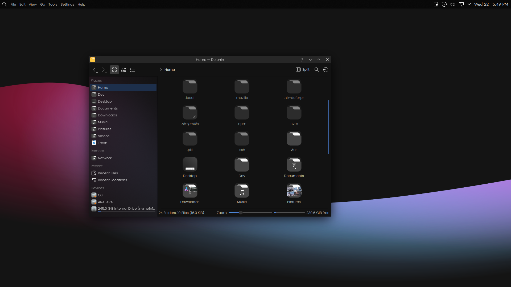
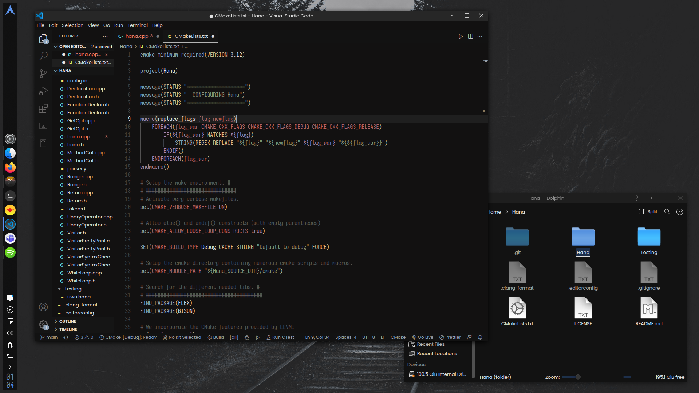
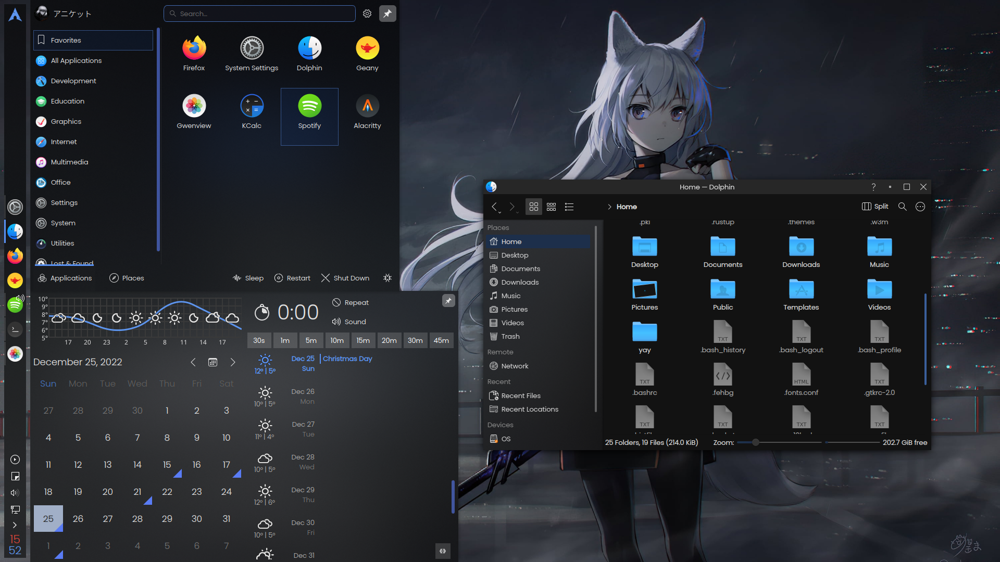
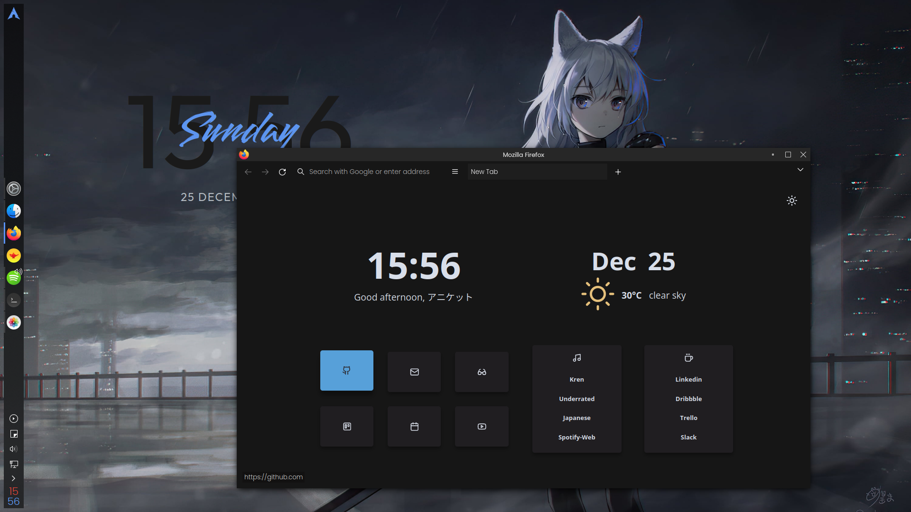

# Kde-Configs

My KDE Plasma setup with Arch Linux :)

⚠️ The [Installation](https://github.com/syylvette/Kde-Configs#installation) section has not been updated, just have changed folder names that you might have to look for. Also check the pinned issues for global menu and other configuration!

## Screenshots

### Havana





### Dusk





<details>
  <summary>Snow-Fox Old</summary>
  
  

  
  
  

  
</details>


## Installation
⚠️ Install script Wip ...

Follow manual installation.
### Dependencies

```bash
sudo pacman -S kdecoration qt5-declarative qt5-x11extras cmake make gcc extra-cmake-modules
```

### Configs

1. Clone the repo
   ```sh
   git clone https://github.com/ryuJin25/Kde-Configs.git ~/Downloads/Kde-Configs
   cd ~/Downloads/Kde-Configs
   ```
2. Install Lightly (Application Style)
   ```bash
   cd ./Application-Style/Lightly && mkdir build && cd build
   cmake -DCMAKE_INSTALL_PREFIX=/usr -DCMAKE_INSTALL_LIBDIR=lib -DBUILD_TESTING=OFF ..
   make
   sudo make install
   ```
3. GTK Theme
   ```bash
   cd ~/Downloads/Kde-Configs/Gtk-Theme/Snow-Gtk/
   sudo make && sudo make install
   ```
4. Install Snow-Lyra (Plasma Style), Just copy the 'Snow-Lyra' folder to ~/.local/share/plasma/desktoptheme/
   ```bash
   sudo cp -r ~/Downloads/Kde-Configs/Plasma-Style/Snow-Lyra ~/.local/share/plasma/desktoptheme/
   ```
   Make the directories if they don't exist.
5. Colors
   ```bash
   sudo cp ~/Downloads/Kde-Configs/Color-Schemes/Snow-Dark.colors ~/.local/share/color-schemes/
   ```
   Make the directory 'color-schemes' in ~/.local/share/ if it doesn't exist.
6. Install Klassy (Window Decoration)
   ```bash
   cd ~/Downloads/Kde-Configs/Window-Decoration/Klassy
   ./install.sh
   ```
7. Fonts
   ```bash
   yay -S ttf-poppins ttf-iosevka-nerd
   ```
   If you don't have 'yay'
   ```bash
   git clone https://aur.archlinux.org/yay.git
   cd yay
   makepkg -si
   ```
8. Icons - 'McMojave-Circle', It can be installed from the settings itself.
   System Settings => Apperance => Icons => Get New Icons.
9. Go ahead and apply the installed theme's in Settings => Appearance, Make sure to change the wallpaper ;)

### Extras
1. Install Spicetify for Spotify
   ```bash
   yay -S spicetify-cli
   ```
   Apply Theme
   ```bash
   sudo cp -r ~/Downloads/Kde-Configs/Cfg/Spicetify/Themes/Snow ~/.config/spicetify/Themes/
   spicetify config current_theme Snow
   spicetify apply
   ```
2. Firefox
   - Open Firefox, Type about:support, and open up the terminal in the `Profile` directory.
     ```bash
     sudo cp -r ~/Downloads/Kde-Configs/Firefox/SimpleFox/chrome .
     ```
   - Go to about:config and set `toolkit.legacyUserProfileCustomizations.stylesheets` to `true`.
   - Restart Firefox.  
3. Neofetch
   ```bash
   sudo pacman -S neofetch
   sudo cp -r ~/Downloads/Kde-Configs/Cfg/Neofetch ~/.config/
   ```
4. Suckless Terminal
   ```bash
   cd ~/Downloads/Kde-Configs/ST/
   ./compilest
   ```

## Summary
+ **Terminal** - WezTerm and Suckless St([St config](https://github.com/ryuJin25/Kde-Configs/tree/main/ST))
+ **Shell** - [Bash config](https://github.com/syylvette/Kde-Configs/blob/main/.bashrc) | zsh (With [Oh-my-zsh](https://ohmyz.sh/) + [Powerlevel10k](https://github.com/romkatv/powerlevel10k))
+ **Application Style** - [Lightly](https://github.com/Luwx/Lightly)
+ **Plasma Style** - [Modified](https://github.com/ryuJin25/Kde-Configs/tree/main/Plasma-Style) Version of Lyra-Dark
+ **Colors** - MateriaDark [Modified](https://github.com/ryuJin25/Kde-Configs/tree/main/Color-Schemes)
+ **Window Decoration** - [Klassy](https://github.com/paulmcauley/klassy)
+ **File Manager** - Dolphin
+ **Firefox** - [CSS](https://github.com/ryuJin25/Kde-Configs/tree/main/Firefox)
+ **Audio Visualizer** - Cava [Config](https://github.com/ryuJin25/Kde-Configs/tree/main/Cfg/Cava)
+ **Fetch Util** - Neofetch [Config](https://github.com/ryuJin25/Kde-Configs/tree/main/Cfg/Neofetch)
+ **Spotify Enhancer** - [Spicetify](https://spicetify.app/docs/advanced-usage/installation/)
+ **Launcher Icon** - [Arch Icon](https://github.com/ryuJin25/Kde-Configs/tree/main/Arch-Icons)
+ **VS Code theme** - [Paradise](https://marketplace.visualstudio.com/items?itemName=Manas.paradise-vscode)

### Widgets
+ [Clear Clock](https://github.com/qewer33/ClearClock)
+ [Event Calendar](https://store.kde.org/p/998901/)

***If you are trying my config's and are stuck feel free to open an issue ^^***
