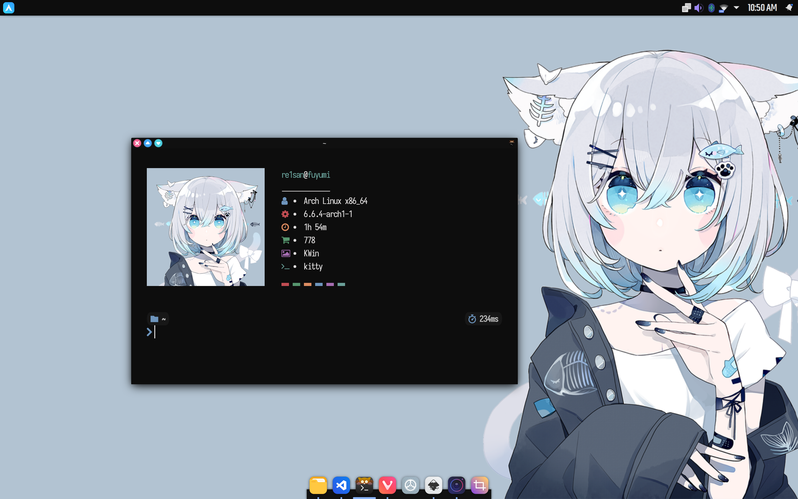

  <h1> Nya! </h1>
  
 Idk, I am sorry !

## Showcase
| <b>Nya</b>                                                                                                  |
| -------------------------------------------------------------------------------------------------------------------- |
|                  |

*Other configs are same as of <a href="https://github.com/re1san/Kde-Dots/tree/mori">Mori</a> branch*
