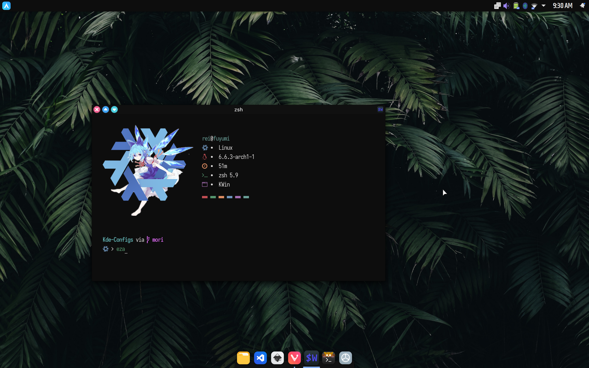
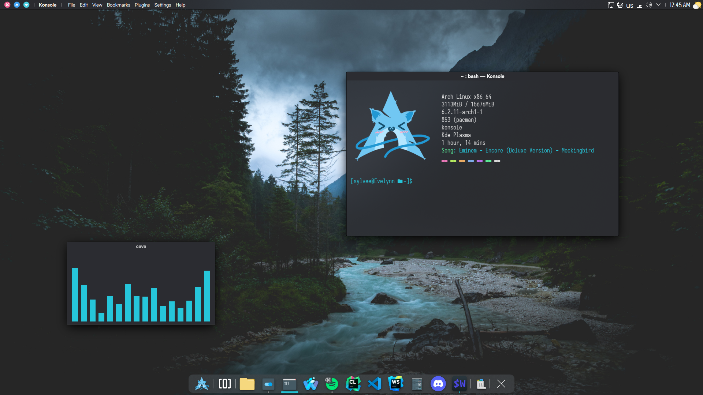

  <h1> Kde-Dots </h1>
  
 Aesthetic dots for Kde Plasma ! ?

> [!Important]
> Installation section is outdated, will update soon :)

> [!Note]
> Themes moved to their respective branch

## Showcase
| <b>Mori森 (New)</b>                                                                                                  |
| -------------------------------------------------------------------------------------------------------------------- |
|                  |

| <b> Havana </b>                                                                                                      |
| -------------------------------------------------------------------------------------------------------------------- |
|      |

| <b> Nx-Desktop </b>                                                                                                  |
| -------------------------------------------------------------------------------------------------------------------- |
|    |
