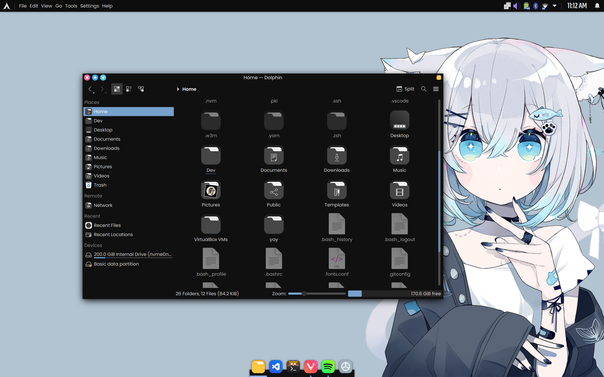

<div align="center">
  <h1> Kde-Dots </h1>
  <p> Aesthetic dots for Kde Plasma!?</p>
</div>

<div align="center">


</div>

> [!Important]
> <a href="#installation">Installation</a> section is updated and tested on fresh install of Arch linux :)

> [!Note]
> Themes moved to their respective branch

## Showcase
| <b>Kitty + Starship</b>                                                                                                  |
| -------------------------------------------------------------------------------------------------------------------- |
| <a href="https://github.com/re1san/Kde-Dots/tree/nya"></a>                 |

| <b>Spotify + Cava</b>                                                                                                  |
| -------------------------------------------------------------------------------------------------------------------- |
| <a href="https://github.com/re1san/Kde-Dots/tree/nya"></a>                 |

| <b>Custom Firefox</b>                                                                                                  |
| -------------------------------------------------------------------------------------------------------------------- |
| <a href="https://github.com/re1san/Kde-Dots/tree/nya"></a>                 |

| <b>Application Style</b>                                                                                                  |
| -------------------------------------------------------------------------------------------------------------------- |
| <a href="https://github.com/re1san/Kde-Dots/tree/nya"></a>                 |

| <b>Custom VS-CODE Theme: <a href="https://github.com/re1san/Tsuki">Tsuki</a></b>                                                                                                  |
| -------------------------------------------------------------------------------------------------------------------- |
| <a href="https://github.com/re1san/Kde-Dots/tree/nya"></a>                 |

<details><summary>Other themes that I used before</summary>

| <b>Mori森</b>                                                                                                  |
| -------------------------------------------------------------------------------------------------------------------- |
| <a href="https://github.com/re1san/Kde-Dots/tree/mori"></a>                 |

| <b> Havana </b>                                                                                                      |
| -------------------------------------------------------------------------------------------------------------------- |
| <a href="https://github.com/re1san/Kde-Dots/tree/havana"></a>     |

| <b> Nx-Desktop </b>                                                                                                  |
| -------------------------------------------------------------------------------------------------------------------- |
| <a href="https://github.com/re1san/Kde-Dots/tree/nx-desk"></a>   |

</details>

## Installation

**Initial Requirements**
* Arch Linux with Kde Plasma (preferred throught `archinstall` script)


**Once you have working setup with Kde Plasma use the commanf below to run install script**
* ```bash
    source <(curl -s https://raw.githubusercontent.com/re1san/Kde-Dots/main/install.sh)
  ```
**After the complete execution of script follow the video to setup**


## Credits

Thanks to all these wonderful people for helping me out!

* [Chadcat](https://github.com/chadcat7)
* [Gwen](https://github.com/elythh)
* [Nitrux](https://github.com/Nitrux)
* [Linuxmobile](https://github.com/linuxmobile)
